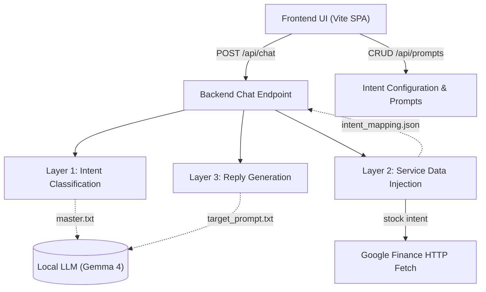

# Nexus Intelligence: System Design Document

## 1. Overview
Nexus Intelligence is a 3-layer AI architectural framework designed to intelligently route user requests, fetch dynamic context (including native web scraping), and utilize state-memory through a localized Large Language Model (LLM). This document outlines the system modules, advanced state-tracking flows, and directory structure.

## 2. Component Architecture

The software is split into two major components:
- **Frontend SPA**: A Vite-powered vanilla JavaScript interface utilizing a premium glassmorphic full-screen layout. Features include a dynamic Chat module and a built-in Settings modal for Prompt editing.
- **Backend Service Layer**: A robust Node.js Express backend acting as the mediator. It manages the 3-Layer execution flow, processes RESTful CRUD operations for dynamic prompt configuration, tracks state-penalties, and performs native HTTP data scraping.

### High-level Service Diagram



## 3. The 3-Layer Execution Flow

The core uniqueness of this framework relies on handling a single user response by making a sequence of asynchronous processing layers.

### Layer 1: Master Layer (Intent Classification & State Memory)
The `currentMessage` payload natively injected by the user is passed to the local LLM. A strict system prompt (`master.txt`) enforces that the LLM behaves solely as an intent classification agent. 
- **Goal**: Classify the raw chat into a controlled string matching the application bounds (e.g., `"greeting"`, `"stock"`, `"restaurant"`, `"weather"`).
- **Off-Topic Penalty**: The backend tracks history to see how many consecutive turns the user is off the target topic of 'restaurants'. If this value hits **3 consecutive turns**, the backend forces a **"redirect"** intent override, circumventing Layer 1 configuration.

### Layer 2: Service Layer & Agentic Resolution
The backend reads `public/config/intent_mapping.json` to lookup the corresponding target prompt and service operation target.
- **Mock Services**: Returns simulated database items (like trending restaurants or weather specs).
- **Agentic Scraper (Stock Fetcher)**: For the `"stock"` intent, the backend pings the LLM internally as a **Ticker Resolution Agent** (e.g. asking it to format "Apple" -> `AAPL:NASDAQ`). It then natively fetches that string against Google Finance and uses regex to extract the precise price and breaking news headline directly out of the raw HTML!

### Layer 3: Reply Creation Layer (Generation)
A dynamically constructed payload is formulated:
1. Reading the target prompt file (e.g., `prompts/stock.txt` or `prompts/redirect.txt`).
2. Appending the dynamically fetched data from Layer 2 (e.g., the JSON-stringified stock pricing or restaurant names).
3. Loading the historical conversation context (chat history).
This finalized context is passed back to the LLM to generate the final end-user reply.

## 4. Prompt Configuration Engine (CRUD)
The system features a complete file-management engine built directly into the UI.
- Users can click "Settings" on the frontend to open the **Prompt Editor**.
- Creating, Editing, or Deleting an intent on the UI sends REST commands (`PUT/POST/DELETE /api/prompts`) to the backend.
- The Node.js application dynamically rewrites `intent_mapping.json`, creates/deletes `.txt` files on the disk, and auto-injects list items directly into `master.txt` without requiring any source code modifications.

## 5. Directory Structure

```text
osm-ai/
│
├── frontend/                     # Client application (Vite SPA)
│   ├── index.html                # Main markup 
│   └── src/
│       ├── main.js               # Frontend chat logic, Prompt CRUD, and Trace modules
│       └── style.css             # Glassmorphism design tokens & styles
│
├── server.js                     # Main executable backend API & Scraper Engine
├── package.json                  # Node dependency manager
│
├── public/
│   ├── config/
│   │   └── intent_mapping.json   # Intent to prompt/service map
│   └── prompts/
│       ├── master.txt            # Layer 1 definition prompt
│       ├── weather.txt           # Target instruction sets
│       ├── restaurant.txt        
│       ├── greeting.txt          
│       ├── redirect.txt          # Forcible state-memory override prompt
│       ├── stock.txt             # Formats real-time scraper output
│       ├── book.txt              
│       └── default.txt           
└── doc/
    └── design.md                 # System architecture (This Document)
```

## 6. Expansion Guidelines
- **Scalability**: New intents simply require mapping a new `.txt` prompt format and updating `intent_mapping.json` (which can be done universally through the UI settings modal). Code changes to the actual routing algorithm are not necessary.
- **Portability**: All references strictly refer to `http://localhost:3000` via backend fetching. The frontend logic allows CORS deployment scaling seamlessly.
